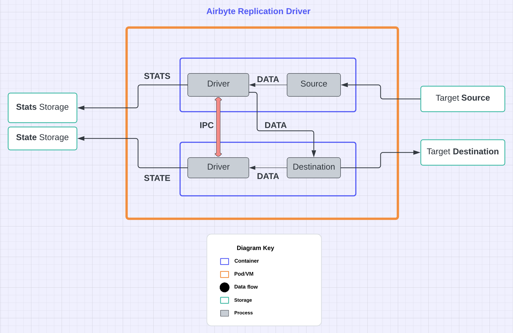
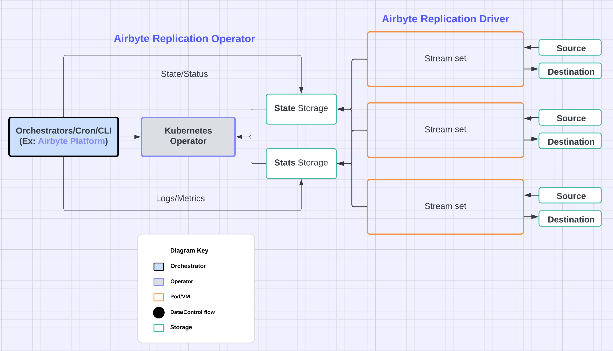

# Quick start

Let's copy some bytes!

## Installation

### From releases

Download from [GitHub releases](https://github.com/h7kanna/airbyte-replication-operator/releases) appropriate for
your
OS.

Example: macOS

```shell
curl -OL https://github.com/pravaah-dev/airbyte-replication-operator/releases/airbyte-replication-operator-aarch64-apple-darwin.tar.gz
tar -xvf airbyte-replication-operator-aarch64-apple-darwin.tar.gz
./airbyte-replication-driver --help

```

### From Container registry

```shell
docker pull h7kanna/airbyte-replication-operator:latest
#or
docker pull ghcr.io/h7kanna/airbyte-replication-operator:latest

```

### From source

You need Rust toolchain to be installed first. Check https://www.rust-lang.org/tools/install

After installing Rust, prepare a cup of your favorite drink and run the build.

```shell
git clone git@github.com:pravaah-dev/airbyte-replication-operator.git
cd airbyte-replication-operator
cargo build --bins --release
./target/release/airbyte-replication-driver --help

```

## Replication Driver

Airbyte replication connectors are run as containers. So we need a container runtime like Docker Desktop.
<br>
But the driver here is agnostic to the container runtime `unlike`
the [Official Airbyte Worker job](https://docs.airbyte.com/understanding-airbyte/jobs#worker-job-architecture).
<br>
The architecture differs in how the driver coordinates the replication process from Source to Destination.
<br>
Driver plays two roles, Source and Destination, and it is run inside the containers.
<br>
The driver processes inside the containers coordinate themselves through IPC (inter-process communication). <br> They
execute an
initialization handshake protocol to start the Source and Destination processes.
<br>
If the process creation is successful Source driver will start replication of data into Destination process.
<br>
Source driver will take care of tracking record flow and publish stats and metrics.
<br>
Destination driver will take care of state persistence.
<br>
Once the replication is complete, the drivers again coordinate the shutdown procedure though IPC and end gracefully.

For the above protocol we need some shared volume for the process pipes. <br/> So an init command is executed at the
startup.



The end effect is we run just two containers. <br/>

We can run the replication using a docker compose when using Docker.

Now as the introduction is out of our way, we shall copy a file from one folder to another using the Airbyte
replication. <br/> Let's
use [Airbyte Connector Source File](https://docs.airbyte.com/integrations/sources/file)
to [Airbyte Connector Destination CSV](https://docs.airbyte.com/integrations/destinations/csv)

À la `cp local/input.csv local/_airbyte_raw_test.csv` ! :smiley:

```shell
cd e2e/hello-airbyte-file-to-csv/docker
docker compose up

```

Let's verify
```shell
chmod +x assert.sh && ./assert.sh

```

Cleanup
```shell
docker compose down && rm -rf ./local/_airbyte_raw_test.csv

```

More example compose files [here](../e2e/hello-airbyte-s3-to-s3)

## Replication Operator

Again, as Airbyte replications are run as containers, we can run them using any Container platform.
<br/>
Plan is to support running on various platforms like Amazon ECS, Fargate etc.

But for our darling Kubernetes, Operator component is
a [Kubernetes Operator](https://kubernetes.io/docs/concepts/extend-kubernetes/operator/) which
runs the above [driver](#replication-driver) as a Pod and takes care of the lifecycle of one replication.

Idea is that higher level Orchestrators can use this as a building block to provider features like scheduling, config
management, UI etc.

And, Kubernetes is one of the pluggable storage options to store the replication state.

As an example, [KubeVela](https://kubevela.io/docs/quick-start) can be used as that high level workflow engine. Check
details [here](Integrations.md#kubevela).
<br/>
A video demo is [here](https://ekalavya.dev/how-to-use-kubevela-for-airbyte-replications).



## CLI

Driver has a CLI interface for some useful operations to view State and Progress of replications.
<br/>
CLI also provides some scheduling(cron) and config management capability for simple use-cases.
<br/>
And in future the envisioned *Airbyte Desktop*, a way to store your personal data using Airbyte replications in your
personal Data Lake.

For all commands

```shell
./airbyte-replication-driver --help
```

Example: Check the status of the replication

```shell
./airbyte-replication-driver --command state --replication hello-airbyte-file-to-csv --store-path tmp

```

## Finally

Hopefully, the above tutorial has helped you understand the usage examples of replication Driver/Operator combo.
<br/>
And more importantly, the value proposition.

So let us start contributing to the awesome [Airbyte](https://github.com/airbytehq/airbyte) ecosystem in a unique way.
<br/>
Shall we?

Check the [Roadmap](../README.md#roadmap) here.

Your feedback is much appreciated.


